# TDD - Test Driven Development

## Projekti loomine vue-cli-ga

Enne projekti tegemist, tee kindlaks, et on installitud vue globaalselt. Kontrollida saab versiooni järgi terminalis - kui näitab versiooni, siis on olemas, kui annab errorit siis tuleb installida.

```
vue --version
```

Tulemus peaks olema midagi sellist (versioon ise võib erineda):

```
@vue/cli 4.5.11
```

Kui ei ole installitud siis seda saate teha käsuga:
```
npm install -g @vue/cli
```

Kui see käsk ei peaks miskipärast toimima (pole admin õigusi vms), siis tuleks seda teha sudoga:
```
sudo npm install -g @vue/cli
```

Peale seda peaksite Te panema ka parooli. 
Windowsi arvutitel peaks siis terminali avama “Run as administrator” vms.
Siis tuleks uuesti kontrollida, et kõik toimis:

```
vue --version
```

Siis ta peaks näitama installitud versiooni.
Õpetus asub ka siin [Vue CLI lehel](https://cli.vuejs.org/guide/installation.html)


### 1. Uue projekti loomine
Projekti nimi peab olema väikeste tähtedega ja koosnema ühest sõnast, mida võib sidekriipsuga eraldada.

```
vue create project-name
```

### 2. Tuleb valida Manually

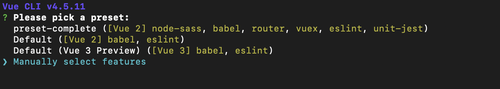

### 3. Siis valida vajalikud vahendid millega tahate tööd teha (tühikuga saab valida):
* Choose Vue version
* Babel
* Router
* Vuex
* CSS Pre-processors
* Linter / Formatter
* Unit testing

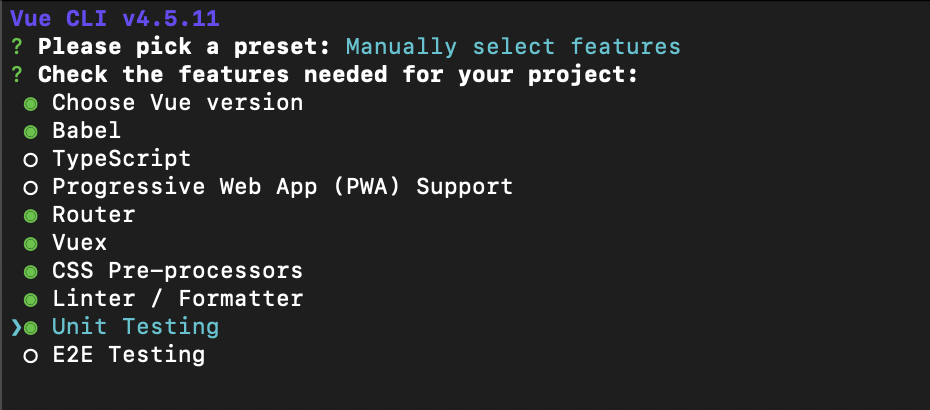

### 4. Valida Vue versioon 2.x (hetkel 3.x ei ole stabiilne arendada, kuna packaged ei pruugi veel sellega toimida).

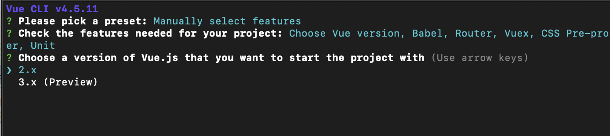

### 5. Kasutada history mode - Y

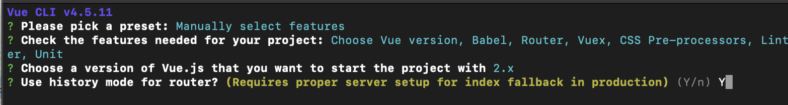


### 6. CSS-i protsessimiseks kasutame Sass/SCSS (with node-sass)

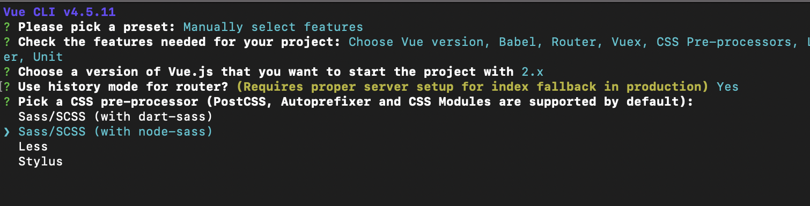

### 7. CSS-i formattimiseks kasutame ESLint + Prettier

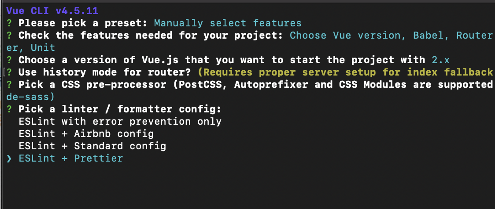

### 8. Ja valime selle, et formattitakse salvestamise peale

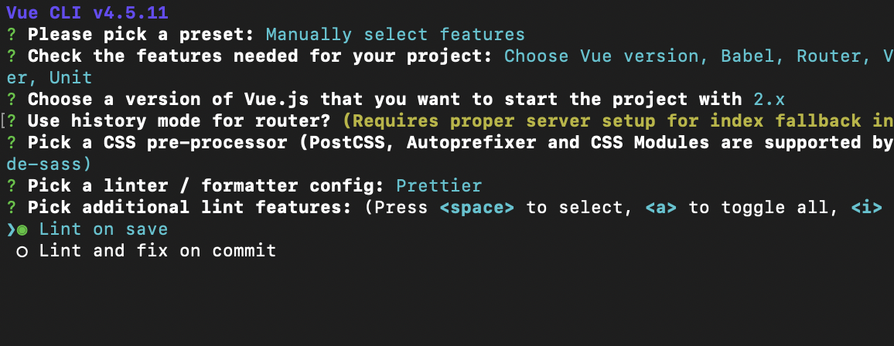

### 9. Testimiseks valime Jesti

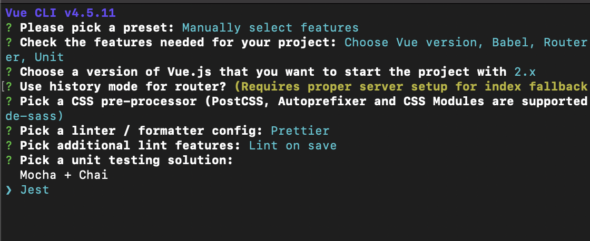

### 10. Konfiguratsiooni tahame näha nendele ette mõeldud failides

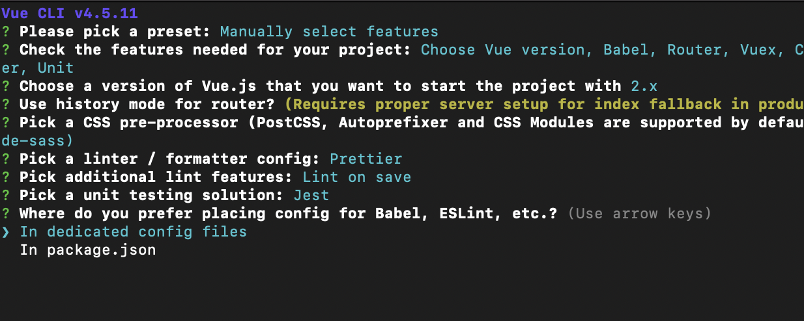

### 11. Kui soovite seda sama konfiguratsiooni uuesti kasutada, siis salvestada see: Y ja panna talle sobiv nimi (mina panin preset-complete)

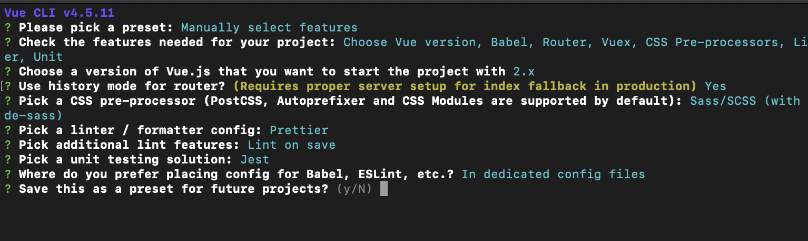

Ja hiljem kui uuesti projekti hakata looma, siis ta juba pakubki mulle preset-complete, st ma ei pea enam uuesti samu asju määrama.

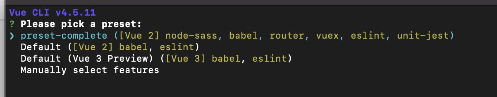


## Vuetify

Selle projekti puhul kasutame libraryt [Vuetify](https://vuetifyjs.com/).

### 1. Selleks lähme oma projekti ja terminalis kirjutame:

```
vue add vuetify
```

### 2. Projekti käivitamine

```
npm run serve
```

### 2. Testide setup Jest + Vuetify

Selleks et unit testid töötaks Vuetify-ga tuleb natukene sätteid lisada.
Kõigepealt js fail tests kausta ehk siis: tests/setup.js

See peaks sisaldama:
```
import Vue from "vue";
import Vuetify from "vuetify";

Vue.use(Vuetify);
```

Õpetus asub ka [Vuetify lehel](https://vuetifyjs.com/en/getting-started/unit-testing/#bootstrapping-vuetify)

Siis tuleb jest.config.js faili lisada uus setting:
```
setupFiles: ["<rootDir>/tests/setup.js"]
```

Kogu fail siis peaks välja nägema selline:
```
module.exports = {
  preset: "@vue/cli-plugin-unit-jest",
  setupFiles: ["<rootDir>/tests/setup.js"]
};
```

### 3. Testi kirjutamine

Juba on loodud tests/unit/xample.spec.js
Nüüd tuleks ka siin failis Vuetify külge panna. Selleks on vaja Vuetify importida ja luua lokaalne Vue instance. Ka selle kohta on näiteid [Vuetify lehel](https://vuetifyjs.com/en/getting-started/unit-testing/#spec-tests)

```
// Imports
import HelloWorld from "@/components/HelloWorld.vue";
import Vuetify from "vuetify";

// Utilities
import { createLocalVue, shallowMount } from "@vue/test-utils";

describe("HelloWorld.vue", () => { // Nimetus - komponendi nimi

  const localVue = createLocalVue();
  let vuetify;

  // Siia panna kõik, mida peaks tegeme enne iga testi jooksutamist
  beforeEach(() => {
    vuetify = new Vuetify();
  });

  it("should take text from msg prop", () => { // Nimetus - mida test peaks tegema
    const msg = "new message";
    const wrapper = shallowMount(HelloWorld, {
      localVue,
      vuetify,
      propsData: { msg }
    });
    expect(wrapper.text()).toMatch(msg);
  });

});
```

NB! Siinse näite jaoks (et test toimiks) peab olema ka puhastatud ja vastav HelloWorld.vue komponent
```
<template>
  <v-container>
    <v-row class="text-center">
      <v-col class="mb-4">
        <h1 class="display-2 font-weight-bold mb-3 title-msg">
          {{ msg }}
        </h1>
      </v-col>
    </v-row>
  </v-container>
</template>

<script>
export default {
  name: "HelloWorld",
  props: {
    msg: String
  },
  data: () => ({})
};
</script>
```

### 4. Testide jooksutamine

```
npm run test:unit
```

### 5. Lisainfo testide kohta:

*[Expect](https://jestjs.io/docs/en/expect)

*[Vue test utils](https://vue-test-utils.vuejs.org/guides/) - näiteid/õpetusi vue komponentide testimiseks

*[Vue test utils properties](https://vue-test-utils.vuejs.org/api/wrapper/#properties) - kuidas/millele ligi saada

*[Snapshot testing](https://jestjs.io/docs/en/snapshot-testing)
